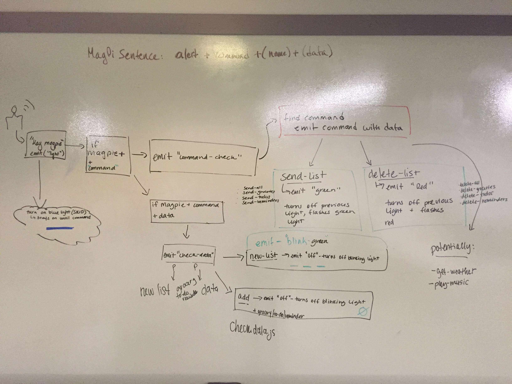

 Mid Term Project
=================================================

## Mag-Pi

### Author: The Pi-Fellows Team: 
Hannah Ingham, Heather Cherewaty, George Raymond, Michael George

### Links and Resources
* [repo](https://github.com/pi-assistant/pi-fellow)
* [travis](http://xyz.com)
* [test-branch](https://github.com/pi-assistant/pi-fellow/tree/test-master) 

#### Documentation
#### jsdocs:
navigate to docs folder in terminal, then `live-server`

### Modules
##### database.js -- stores methods to read, write, and update db.json
##### events.js -- exports event emitter object

### Setup
#### `.env` requirements
* `PORT` - defined in `.env`
* your peronsal telegram chat_id with @MagPi
* telegram bot id
* path to google cloud speech api json key

#### Running the app
* `node index.js`
* Interacting with your MagPi:
- speak clearly
- pause and wait for light confirmation 
- expect red flashing lights on MagPi/user error

##### To create new list
`hey MagPi` pause `new list` pause `{listname}` pause `{items to add to list}`

##### To add to existing list
`hey MagPi` pause `add` pause `{name of exiting list}` pause `{items to add to list}`

##### To send your lists
`hey MagPi` pause `send` pause `{list to be sent}`

##### To send all your lists
`hey MagPi` pause `send all`

##### On MagPi/user error
`hey siri` -- no response
`hey MagPi` pause `play spotify` -- command unknown

#### Tests
* Must be on test-master branch `npm test`
* Testing emitters: Use spies on console logs in functions with event emitters to test

#### UML

## How to Set-up Your Raspberry Pi Device:
[Raspberry Pi 3 Setup](https://www.google.com/search?q=raspberry+pi+getting+started&rlz=1C1CHBF_enUS749US749&oq=raspb&aqs=chrome.0.69i59j0j69i60j69i59j69i57j69i60.1520j0j9&sourceid=chrome&ie=UTF-8#kpvalbx=1)

The video above covers everything you need to set up your Raspberry Pi 3 from out of the box. This is what we used to setup, install, and configure ours. 

### How to Set-up Your Microphone and Headphones on Your Raspberry Pi Device:
I followed this tutorial to set up our Audo input and output: [Audio Setup](https://maker.pro/raspberry-pi/tutorial/the-best-voice-recognition-software-for-raspberry-pi)

We used the USB Microphone from VALinks [Microphone on Amazon](https://www.amazon.com/VAlinks-Microphone-Recording-Compatible-Raspberry/dp/B014MASID4)

### Getting Started:

To get started, unpackage your microphone and plug it into an available USB slot on your Raspberry Pi device. 

To make sure that your Raspberry Pi device recognizes your usb microphone, type 'lsusb' in your terminal. You should see something like 'Bus 001 Device 010: ID 8086:080 Intel Corp.' along with any other usb device you had plugged in. If you see that, your device recognizes it. 

The next step is to create an audio recording through your device for proof of life. To do this, type “arecord -D plughw:1,0 -d 3 test.wav”. This will create a 3 second audio recording, and it is listening for sounds from the microphone. So as soon as you hit enter, begin speaking into the microphone for 3 seconds. 

After you have completed the recording, type “aplay test.wav” in your terminal, and your recording should be playing!

#### Setting up microphone on raspberry pi:
To use an analouge headset with an 3.5mm AUX plugin type of the follwing command in the terminal to switch your audio output device to your 3.5mm AUX headphones:

  amixer cset numid=3 1

#### Get Google Could Speech and Telegram credentials 
[google-cloud-speech](https://cloud.google.com/speech-to-text/?utm_source=google&utm_medium=cpc&utm_campaign=na-US-all-en-dr-bkws-all-all-trial-b-dr-1003905&utm_content=text-ad-none-any-DEV_c-CRE_113193385927-ADGP_Hybrid+%7C+AW+SEM+%7C+SKWS+%7C+US+%7C+en+%7C+BMM+~+Speech+API-KWID_43700009979724579-kwd-141369776212&utm_term=KW_%2Bcloud%20%2Bspeech-ST_%2Bcloud+%2Bspeech&gclid=Cj0KCQiAhKviBRCNARIsAAGZ7Cfwiu2bc5choiq4lzMEOMWAtpmHue04aNujXc2cHJj40SgtVbkvQq8aAqlPEALw_wcB)
[telegram](https://core.telegram.org/)
